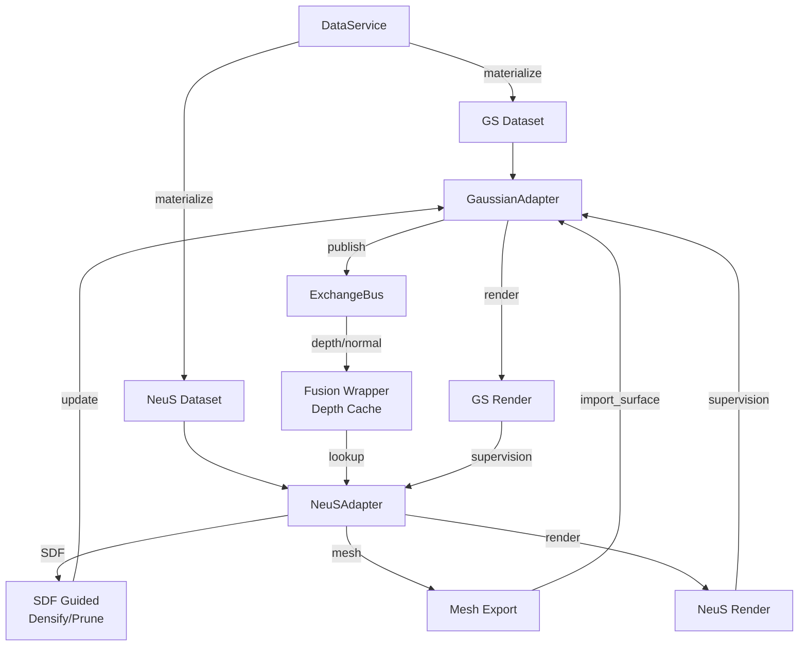

# GS-NeuS Fusion 系统完整技术文档

## 1. 系统概览

### 1.1 设计理念

Fusion 系统采用**非侵入式架构**，将 Gaussian Splatting (3DGS) 和 NeuS 两个独立的神经渲染系统通过适配器模式深度融合，实现以下核心能力：

1. **双向信息传递**：GS 的深度/法线图指导 NeuS 采样，NeuS 的 SDF 引导 GS 稠密化/剪枝
2. **几何一致性约束**：通过深度和法线监督确保两个模型学习到一致的几何表示
3. **模块化解耦**：无需修改原始代码库，通过适配器和总线实现松耦合集成

### 1.2 目录结构

```
fusion/
├── __init__.py              # 模块导出
├── common.py                # 共享数据类和基类
├── data_service.py          # 统一数据服务
├── gaussian_adapter.py      # 3DGS 适配器
├── neus_adapter.py          # NeuS 适配器
└── fusion_wrapper.py        # 融合调度器
```

---

## 2. 核心组件详解

### 2.1 数据类 (common.py)

#### SceneSpec
场景配置的高层描述，定义所有路径和参数：
```python
@dataclass
class SceneSpec:
    scene_name: str                    # 场景名称
    dataset_root: str                  # 原始数据集路径
    gaussian_source_path: str          # GS 输入工作空间
    gaussian_model_path: str           # GS 模型输出路径
    neus_conf_path: str               # NeuS 配置文件
    neus_case: str                    # NeuS case 名称
    shared_workspace: str             # 融合共享工作空间
    resolution_scales: Tuple[float, ...] = (1.0,)
    device: str = "cuda"
    white_background: bool = False
```

#### GaussianIterationState
记录一次 GS 优化步骤的快照：
- `iteration`: 当前迭代次数
- `loss`: 总损失
- `l1`, `ssim`: 图像质量指标
- `lr_position`: 位置学习率
- `num_gaussians`: 当前高斯数量

#### NeuSIterationState
记录一次 NeuS 优化步骤的快照：
- `iteration`: 当前迭代次数
- `loss`: 总损失
- `color_loss`: 颜色损失
- `eikonal_loss`: Eikonal 正则化损失
- `lr`: 学习率

---

### 2.2 工具类 (common.py)

#### APIRegistry
API 注册表，管理所有可调用接口：
- `register(name, func, description)`: 注册新 API
- `call(name, *args, **kwargs)`: 调用已注册 API
- `describe()`: 返回所有 API 的描述文档

#### ExchangeBus
发布/订阅总线，用于模块间异步通信：
- `publish(topic, payload)`: 向主题发布消息
- `subscribe(topic, callback)`: 订阅主题并注册回调

**关键主题**：
- `gaussian.render_outputs`: GS 渲染输出（深度/法线）
- `gaussian.train_step`: GS 训练步骤完成
- `neus.train_step`: NeuS 训练步骤完成

#### MutableHandle
上下文管理器，提供受控的状态修改能力：
```python
with wrapper.mutable("gaussian", "optimizer") as opt:
    opt.param_groups[0]['lr'] = 0.001  # 临时修改学习率
# 退出时自动提交或回滚
```

---

### 2.3 数据服务 (data_service.py)

#### DataService
统一数据集访问接口，确保所有组件使用相同的数据源。

**核心功能**：

1. **数据集巡检**
   - `list_images()`: 列出所有图像路径
   - `get_image_path(index_or_name)`: 通过索引/名称获取图像
   - `get_sparse_bundle()`: 返回 COLMAP sparse bundle 路径
   - `load_poses_bounds()`: 加载 mip-NeRF360 相机姿态

2. **数据物化 (Materialization)**
   - `materialize_gaussian_scene(target_root)`: 为 3DGS 准备目录结构
     - 复制 `images/` 和 `sparse/`
     - 确保 `poses_bounds.npy` 存在
   - `materialize_neus_scene(target_root)`: 为 NeuS 准备目录结构
     - 转换图像为 PNG 格式
     - 生成白色 mask (如果不存在)
     - 生成 `cameras_sphere.npz` (从 `poses_bounds.npy` 转换)

**相机转换逻辑**：
- 从 mip-NeRF360 的 `poses_bounds.npy` 提取相机姿态
- 计算场景中心和缩放因子（归一化到单位球）
- 生成 NeuS 需要的 `world_mat`、`scale_mat` 等矩阵

---

### 2.4 Gaussian Splatting 适配器 (gaussian_adapter.py)

#### GaussianSplattingAdapter
封装 3DGS 训练、渲染和属性访问。

**初始化流程** (`bootstrap`):
1. 解析 3DGS 命令行参数 (ModelParams, OptimizationParams, PipelineParams)
2. 使用 `DataService.materialize_gaussian_scene()` 准备数据
3. 创建 `GaussianModel` 和 `Scene`
4. 调用 `gaussians.training_setup(optim)` 初始化优化器

**注册的 API**:
- `gaussian.train_step`: 执行一步优化
- `gaussian.render`: 渲染指定相机
- `gaussian.export_surface`: 导出点云为 PLY
- `gaussian.import_surface`: 从网格导入新点云

**关键方法**:

1. **train_step()**
   - 随机选择训练相机
   - 渲染当前视角
   - 计算 L1 + SSIM 损失
   - 反向传播并更新参数
   - **发布渲染输出到总线** (`_publish_render_outputs`)

2. **_publish_render_outputs()**
   - 提取深度/法线图
   - 生成多种相机 ID 格式（兼容 NeuS 查找）:
     - `primary_key`: 图像文件名 stem (如 `"000001"`)
     - `alternative_keys`: 完整文件名 + 数字索引
   - 发布到 `gaussian.render_outputs` 主题

3. **import_surface(mesh_path, sh_degree=3)**
   - 从网格采样点云（默认 500k 点）
   - 创建新的高斯参数（xyz, features, opacity, scaling, rotation）
   - **原子更新**：所有参数准备完毕后一次性赋值
   - **关键修复**：调用 `training_setup()` 重置优化器和缓冲区
   - **关键修复**：手动重置 `max_radii2D` 以匹配新点云数量
   - **张量形状**：
     - `features_dc`: `(N, 1, 3)`
     - `features_rest`: `(N, 15, 3)` (SH degree=3)

**属性访问器** (SuGaR 风格):
- `get_gaussian_xyz(detach, mask)`: 获取中心位置
- `get_gaussian_features(detach, mask)`: 获取 SH 特征
- `get_gaussian_scaling(detach, mask, activated)`: 获取缩放参数
- `get_gaussian_rotation(detach, mask, normalized)`: 获取旋转四元数
- `get_gaussian_opacity(detach, mask, activated)`: 获取不透明度

---

### 2.5 NeuS 适配器 (neus_adapter.py)

#### NeuSAdapter
封装 NeuS 训练、SDF 评估和深度引导采样。

**初始化流程** (`bootstrap`):
1. 解析 NeuS 配置文件
2. 使用 `DataService.materialize_neus_scene()` 准备数据
3. 创建 `Runner` 实例并初始化 NeuS 模型

**注册的 API**:
- `neus.train_step`: 执行一步优化
- `neus.export_surface`: 导出 mesh (marching cubes)
- `neus.evaluate_sdf`: 评估给定点的 SDF 值（无梯度）
- `neus.inject_supervision`: 接受外部监督（如 GS 渲染）

**核心功能**:

1. **深度引导采样** (`_override_near_far_with_depth`)
   - 从 `depth_cache` 查找当前相机的深度图
   - 采样光线对应像素的深度值 D
   - 在深度处评估 NeuS SDF，得到 s
   - 计算自适应采样窗口: `[near, far] = [D - k|s|, D + k|s|]`
   - **缓存查找策略**：
     - 生成多个候选键（数字索引、stem、完整文件名）
     - 遍历候选键查找缓存
     - 检查缓存新鲜度 (`max_age`)
   - **张量处理**：自动挤压深度张量维度 `[C, H, W] → [H, W]`

2. **相机键匹配** (`_camera_key_from_idx`)
   ```python
   def _camera_key_from_idx(self, idx: int) -> list:
       keys = [idx]  # 数字索引
       if hasattr(dataset, 'images_lis'):
           path = Path(dataset.images_lis[idx])
           keys.append(path.stem)       # 文件名 stem
           keys.append(path.name)       # 完整文件名
           try:
               keys.append(int(path.stem))  # 数字 stem
           except ValueError:
               pass
       return keys
   ```

3. **SDF 引导几何监督** (`_sample_gs_depth_normal`)
   - 从缓存获取 GS 渲染的深度/法线
   - 在采样点位置查找对应深度和法线
   - 返回监督信号，用于计算几何一致性损失

4. **train_step()**
   - 调用 `_override_near_far_with_depth()` 修改采样范围
   - 执行 NeuS 前向传播和损失计算
   - 反向传播并更新参数
   - 发布训练状态到总线

**SDF 评估** (`evaluate_sdf`):
- 接受任意 3D 点坐标 `(N, 3)`
- 返回 SDF 值 `(N, 1)` (无梯度)
- 用于 SDF 引导的稠密化/剪枝

---

### 2.6 融合调度器 (fusion_wrapper.py)

#### FusionWrapper
顶层协调器，管理整个融合训练流程。

**初始化** (`__init__`):
1. 创建 `APIRegistry` 和 `ExchangeBus`
2. 加载融合配置:
   - `depth_guidance`: 深度引导参数 (k, min_near, max_far, max_age)
   - `sdf_guidance`: SDF 引导参数 (σ, ω_g, ω_p, τ_g, τ_p)
   - `geom_loss`: 几何监督参数 (depth_w, normal_w, eps)
3. 初始化深度缓存 (`depth_cache`)
4. 创建 GS 和 NeuS 适配器
5. 订阅 `gaussian.render_outputs` 主题

**缓存管理** (`_on_gaussian_render`):
```python
def _on_gaussian_render(self, payload: Dict[str, Any]):
    key = payload.get("camera_id")
    entry = {
        "depth": payload.get("depth"),
        "normal": payload.get("normal"),
        "iteration": payload.get("iteration"),
    }
    # 存储到主键
    self.depth_cache[key] = entry
    # 同时存储到备用键
    for alt_key in payload.get("alternative_keys", []):
        self.depth_cache[alt_key] = entry
```

**SDF 引导稠密化/剪枝** (`_sdf_guided_gaussian_update`):

遵循以下流程（对应 `train.py` 164-174 行）：

1. **检查执行条件**:
   - 仅在 500 ≤ iteration < 15000 范围内执行
   - 每 100 步执行一次（与标准 3DGS 一致）

2. **计算表面权重**:
   ```python
   sdf = neus.evaluate_sdf(xyz)  # 评估所有高斯的 SDF
   μ(s) = exp(-s²/(2σ²))          # 表面权重函数
   ```

3. **增强梯度**:
   ```python
   ε_g = ∇g + ω_g * μ(s) * (μ > 0.5)  # 只增强表面附近点
   ```

4. **调用官方 densify_and_prune**:
   ```python
   gaussians.densify_and_prune(
       max_grad=τ_g,          # 梯度阈值 (默认 0.0002)
       min_opacity=τ_p,       # 不透明度阈值 (默认 0.01)
       extent=scene.cameras_extent,
       max_screen_size=20,    # 屏幕尺寸阈值
       radii=max_radii2D
   )
   ```

**联合训练步骤** (`joint_step`):
```python
def joint_step(self, mesh_every=100, log_every=100):
    # 1. NeuS 训练（使用深度引导采样 + 几何监督）
    neus_state = self.neus.train_step()
    
    # 2. 周期性网格同步：NeuS mesh → GS points
    if neus_state.iteration % mesh_every == 0:
        self.neus_to_gaussian()
    
    # 3. GS 训练（发布深度/法线到总线）
    gaussian_state = self.gaussian.train_step()
    
    # 4. SDF 引导稠密化/剪枝
    self._sdf_guided_gaussian_update()
    
    # 5. 打印统计信息
    if log_every > 0:
        self.print_statistics(interval=log_every)
        
    return payload
```

**统计信息** (`get_statistics`):
- `depth_cache_size`: 缓存条目数
- `depth_hit_rate`: 深度引导命中率
- `num_gaussians`: 当前高斯数量
- `densify_count`, `prune_count`: 累计稠密化/剪枝数量
- `neus_iteration`: NeuS 迭代次数

---

## 3. 融合机制详解

### 3.1 GS → NeuS：深度引导采样

**目标**：利用 GS 的深度图优化 NeuS 的光线采样区间，提高采样效率。

**实现流程**:

1. **GS 发布深度图**:
   ```python
   # gaussian_adapter.py: _publish_render_outputs()
   payload = {
       "camera_id": "_DSC8766",
       "alternative_keys": ["_DSC8766.JPG", 8766],
       "depth": depth_tensor,  # [H, W] or [1, H, W]
       "normal": normal_tensor,
       "iteration": 500
   }
   bus.publish("gaussian.render_outputs", payload)
   ```

2. **Fusion Wrapper 缓存深度**:
   ```python
   # fusion_wrapper.py: _on_gaussian_render()
   for key in [primary_key] + alternative_keys:
       depth_cache[key] = entry
   ```

3. **NeuS 查找并使用深度**:
   ```python
   # neus_adapter.py: _override_near_far_with_depth()
   candidates = [idx, "_DSC8766", "_DSC8766.JPG", 8766]
   for key in candidates:
       if key in depth_cache:
           depth_entry = depth_cache[key]
           break
   
   # 采样光线对应像素的深度
   D = depth_entry["depth"][pixels_y, pixels_x]
   
   # 在深度处评估 SDF
   center = rays_o + D * rays_d
   s = neus.sdf_network.sdf(center)
   
   # 计算自适应窗口
   near = max(D - k * |s|, min_near)
   far = min(D + k * |s|, max_far)
   ```

**关键参数**:
- `k`: 窗口乘数（默认 3.0）
- `max_age`: 缓存有效期（默认 1000，避免随机采样时频繁失效）

### 3.2 NeuS → GS：SDF 引导稠密化/剪枝

**目标**：利用 NeuS 的 SDF 引导 GS 的点云优化，在表面附近加密，远离表面则剪枝。

**核心公式**:

1. **表面权重函数**:
   ```
   μ(s) = exp(-s²/(2σ²))
   ```
   - s: SDF 值（有符号距离）
   - σ: 衰减率（控制权重下降速度）
   - μ 在表面处（s=0）最大（=1），远离表面时快速衰减

2. **增强梯度**（稠密化准则）:
   ```
   ε_g = ∇g + ω_g * μ(s) * 𝟙(μ > 0.5)
   ```
   - ∇g: 原始梯度累积
   - ω_g: SDF 权重（默认 0.3，防止过度稠密化）
   - 仅增强表面附近的梯度

3. **稠密化判据**:
   ```
   if ‖ε_g‖ > τ_g:  # τ_g = 0.0002
       densify_and_clone() 或 densify_and_split()
   ```

4. **剪枝判据**:
   ```
   ε_p = σ_a - ω_p * (1 - μ(s))
   if ε_p < τ_p:  # τ_p = 0.01
       prune()
   ```
   - 远离表面 (μ≈0) 且不透明度低的点被剪枝

**执行频率**:
- 每 100 步执行一次
- 仅在 500 ≤ iteration < 15000 范围内

### 3.3 几何一致性监督

**目标**：确保 GS 和 NeuS 学习到一致的几何表示。

**监督信号**:
1. **深度监督**:
   ```python
   depth_gs = render_gs(camera)["depth"]
   depth_neus = render_neus(camera)["depth"]
   loss_depth = ‖depth_gs - depth_neus‖₁
   ```

2. **法线监督**:
   ```python
   normal_gs = render_gs(camera)["normal"]
   normal_neus = ∇SDF(points) / ‖∇SDF(points)‖
   loss_normal = ‖normal_gs - normal_neus‖₁
   ```

**权重配置**:
- `depth_w`: 1.0
- `normal_w`: 0.1

---

## 4. 数据流图



---

## 5. 使用示例

### 5.1 基本联合训练

```python
from fusion import FusionWrapper, DataService, SceneSpec
from pathlib import Path

# 1. 配置场景
spec = SceneSpec(
    scene_name="bicycle",
    dataset_root="data/bicycle",
    gaussian_source_path="work/gaussian_sources/bicycle",
    gaussian_model_path="work/gaussian_models/bicycle",
    neus_conf_path="NeuS/confs/womask.conf",
    neus_case="bicycle",
    shared_workspace="work/fusion_workspace/bicycle",
    device="cuda"
)

# 2. 初始化数据服务
data_service = DataService(Path(spec.dataset_root))

# 3. 配置融合参数
fusion_cfg = {
    "depth_guidance": {
        "k": 3.0,
        "min_near": 0.01,
        "max_far": 100.0,
        "max_age": 1000
    },
    "sdf_guidance": {
        "sigma": 0.5,
        "omega_g": 0.3,
        "omega_p": 0.5,
        "tau_g": 0.0002,
        "tau_p": 0.01
    },
    "geom_loss": {
        "depth_w": 1.0,
        "normal_w": 0.1
    }
}

# 4. 创建融合包装器
wrapper = FusionWrapper(
    spec=spec,
    gaussian_repo=Path("gaussian_splatting"),
    neus_repo=Path("NeuS"),
    data_service=data_service,
    gaussian_cfg={},
    neus_cfg={},
    fusion_cfg=fusion_cfg
)

# 5. 初始化模型
wrapper.bootstrap()

# 6. 联合训练
for step in range(1, 30001):
    payload = wrapper.joint_step(
        mesh_every=500,   # 每 500 步同步 mesh
        log_every=100     # 每 100 步打印统计
    )
    
    # 定期保存
    if step % 5000 == 0:
        wrapper.gaussian.export_surface(iteration=step)
        wrapper.neus.export_mesh(resolution=512)
```

### 5.2 调用注册的 API

```python
# 查看所有可用 API
apis = wrapper.describe_apis()
for name, desc in apis.items():
    print(f"{name}: {desc}")

# 直接调用 API
wrapper.registry.call("gaussian.train_step")
mesh_path = wrapper.registry.call("neus.export_surface", resolution=512)
sdf_values = wrapper.registry.call("neus.evaluate_sdf", points)
```

### 5.3 监控统计信息

```python
stats = wrapper.get_statistics()
print(f"Depth Cache Size: {stats['depth_cache_size']}")
print(f"Hit Rate: {stats['depth_hit_rate']:.2%}")
print(f"Num Gaussians: {stats['num_gaussians']}")
print(f"Densify/Prune: +{stats['densify_count']} / -{stats['prune_count']}")
```

---

## 6. 关键调试信息

### 6.1 缓存键匹配

**GS 发布**:
```
[GS Cache] Publishing camera_id=_DSC8766, alt_keys=['_DSC8766.JPG', 8766], name=_DSC8766.JPG
```

**Fusion 缓存**:
```
[Cache Update] Stored depth/normal under keys: ['_DSC8766', '_DSC8766.JPG', 8766], cache_size=388
```

**NeuS 查找**:
```
[NeuS Lookup] Trying keys: [tensor(102), '_DSC8782', '_DSC8782.png'], cache_keys=[...]
[NeuS Lookup] ✓ HIT - Found cache entry with key=_DSC8782
[NeuS Lookup] ✓ SUCCESS - Applied depth guidance, hit_rate=100/201
```

### 6.2 常见问题

**问题 1**: 缓存命中率为 0%
- **原因**: 键格式不匹配
- **解决**: 检查 `_camera_key_from_idx` 和 `_publish_render_outputs` 生成的键是否一致

**问题 2**: `STALE` 警告频繁
- **原因**: `max_age` 太小，随机采样导致缓存频繁过期
- **解决**: 增大 `max_age`（如 1000）

**问题 3**: `SAMPLE FAILED - index out of bounds`
- **原因**: 深度张量维度不匹配 `[C, H, W]` vs `[H, W]`
- **解决**: 在采样前 `squeeze(0)` 挤压通道维度

**问题 4**: `RuntimeError: Sizes of tensors must match`
- **原因**: `import_surface` 更新参数后未重置优化器
- **解决**: 调用 `training_setup()` 和手动重置 `max_radii2D`

---

## 7. 参数调优指南

### 7.1 深度引导参数

| 参数 | 默认值 | 建议范围 | 说明 |
|------|--------|----------|------|
| k | 3.0 | 2.0-5.0 | 窗口乘数，越大采样范围越宽 |
| min_near | 0.01 | 0.001-0.1 | 最小近平面，防止采样过近 |
| max_far | 100.0 | 10-200 | 最大远平面，根据场景尺度调整 |
| max_age | 1000 | 500-2000 | 缓存有效期，随机采样需更大值 |

### 7.2 SDF 引导参数

| 参数 | 默认值 | 建议范围 | 说明 |
|------|--------|----------|------|
| σ | 0.5 | 0.3-1.0 | 表面权重衰减率，影响 μ(s) 下降速度 |
| ω_g | 0.3 | 0.1-0.5 | 稠密化权重，过大会导致过度稠密化 |
| ω_p | 0.5 | 0.3-0.8 | 剪枝权重 |
| τ_g | 0.0002 | 0.0001-0.001 | 稠密化阈值，越小越容易触发 |
| τ_p | 0.01 | 0.005-0.02 | 剪枝阈值，越大越激进 |

### 7.3 几何监督参数

| 参数 | 默认值 | 建议范围 | 说明 |
|------|--------|----------|------|
| depth_w | 1.0 | 0.5-2.0 | 深度一致性权重 |
| normal_w | 0.1 | 0.05-0.3 | 法线一致性权重 |

---

## 8. 性能优化建议

1. **缓存管理**:
   - 定期清理过期缓存（>5000 步）
   - 使用 LRU 策略限制缓存大小

2. **稠密化/剪枝频率**:
   - 降低执行频率（如每 200 步）可减少开销
   - 在训练后期（>10000 步）可禁用 SDF 引导

3. **网格同步频率**:
   - 初始阶段（<2000 步）可提高频率（100 步）
   - 稳定阶段可降低频率（1000 步）

4. **深度引导采样**:
   - 仅在重要视角使用深度引导
   - 随机跳过部分查找以降低开销

---

## 9. 总结

Fusion 系统通过以下设计实现了 GS 和 NeuS 的深度集成：

✅ **非侵入性**：无需修改原始代码库  
✅ **模块化**：清晰的职责划分和接口定义  
✅ **高效通信**：基于总线的异步消息传递  
✅ **鲁棒性**：完善的错误处理和调试支持  
✅ **可扩展性**：易于添加新的融合机制

通过深度引导采样、SDF 引导稠密化和几何监督三大机制，系统实现了两个模型的优势互补，在保留各自优点的同时显著提升了重建质量。
